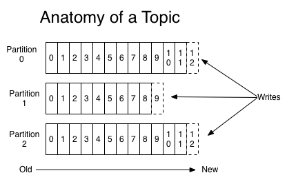
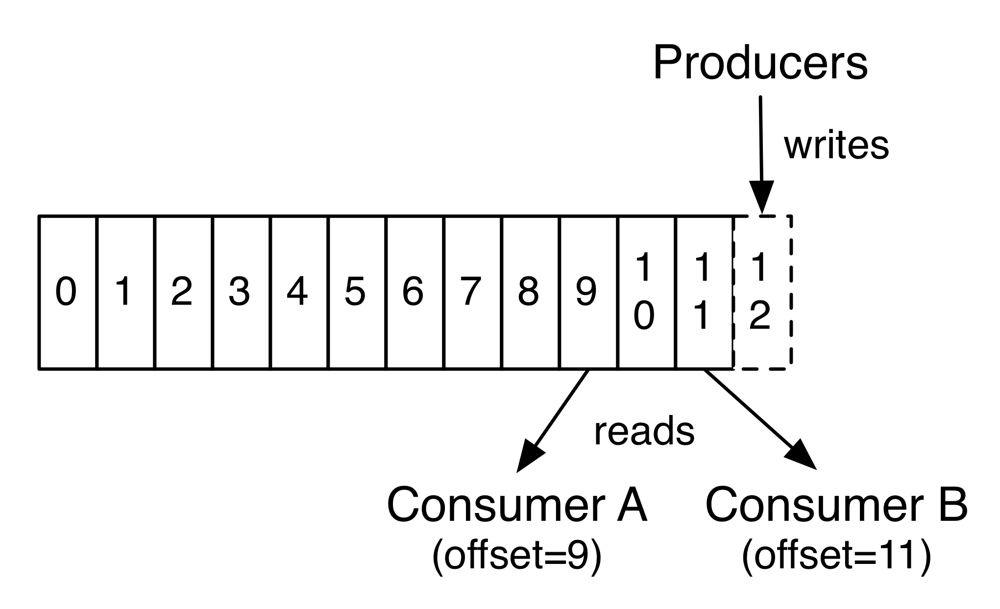
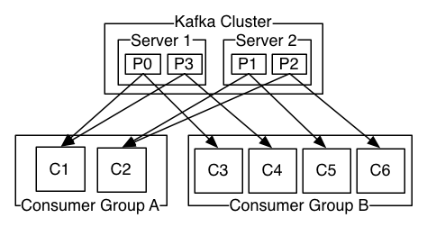

* `Broker` 可以简单理解为一个 Kafka 节点, 多个 Broker 节点构成整个 Kafka 集群;
* `Topic` 某种类型的消息的合集;
    * `Partition` 它是 Topic 在物理上的分组, 多个 Partition 会被分散地存储在不同的 Kafka 节点上; 单个 Partition 的消息是保证有序的, 但整个 Topic 的消息就不一定是有序的;
    * `Segment` 包含消息内容的指定大小的文件, 由 index 文件和 log 文件组成; 一个 Partition 由多个 Segment 文件组成
        * `Offset` Segment 文件中消息的索引值, 从 0 开始计数
    * `Replica` (N) 消息的冗余备份, 表现为每个 Partition 都会有 N 个完全相同的冗余备份, 这些备份会被尽量分散存储在不同的机器上;
* `Producer` 通过 Broker 发布新的消息到某个 Topic 中;
* `Consumer` 通过 Broker 从某个 Topic 中获取消息;

https://scala.cool/2018/03/learning-kafka-1/

