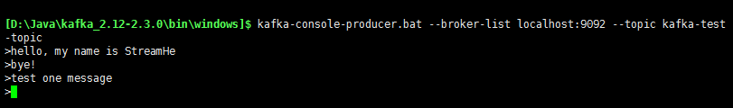
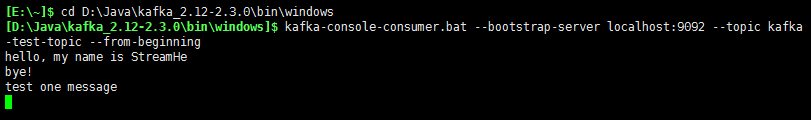

##window 下操作
命令到程序目录下
~~~
cd D:\Java\kafka_2.12-2.3.0\bin\windows
~~~

###启动自带的zookeeper
~~~
zookeeper-server-start.bat ..\..\config\zookeeper.properties
~~~
默认zookeeper端口：**2181**

###启动kafka
~~~
kafka-server-start.bat ..\..\config\server.properties
~~~
默认kafka端口：**9092**

###创建一个主题 **topics**
~~~
kafka-topics.bat --create --zookeeper localhost:2181 --replication-factor 1 --partitions 1 --topic kafka-test-topic
~~~
_kafka-test-topic 为topics名称_

###查看主题列表
~~~
kafka-topics.bat --list --zookeeper localhost:2181
~~~
###启动生产者
~~~
kafka-console-producer.bat --broker-list localhost:9092 --topic kafka-test-topic
~~~

###启动消费者
~~~
kafka-console-consumer.bat --bootstrap-server localhost:9092 --topic kafka-test-topic --from-beginning
~~~

